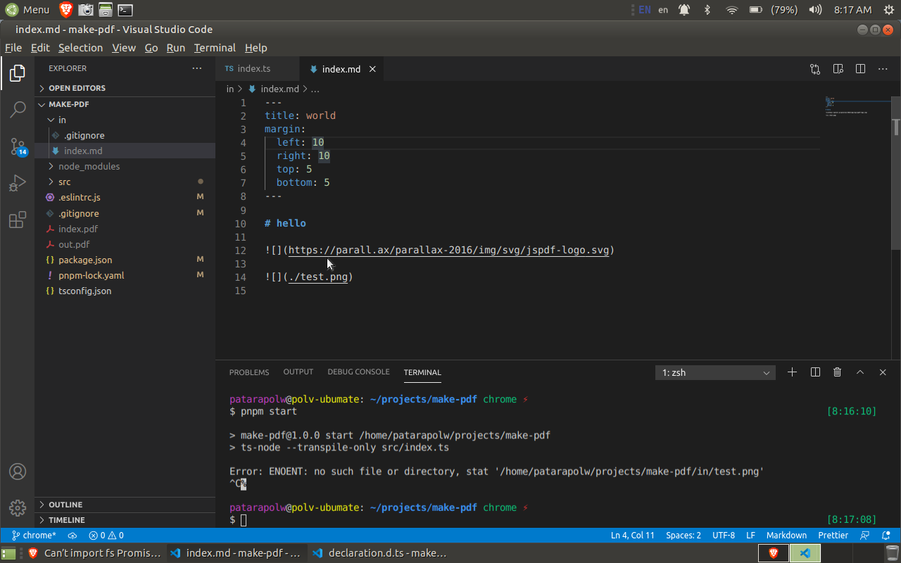

<!-- https://wiki.contextgarden.net/Layout -->
<!-- https://tex.stackexchange.com/questions/71048/how-to-set-the-page-layout-dimensions-in-context -->

\setuppapersize[A4, portrait]
\setuplayout[
  header=0pt,
  margin=2cm,
  footerdistance=0pt]

# Creating PDF's from markdown

With features that markdown normally won't have.

\pagebreak

## So, I can use LaTeX inside Markdown

{{{ include "0.25.md" }}}
